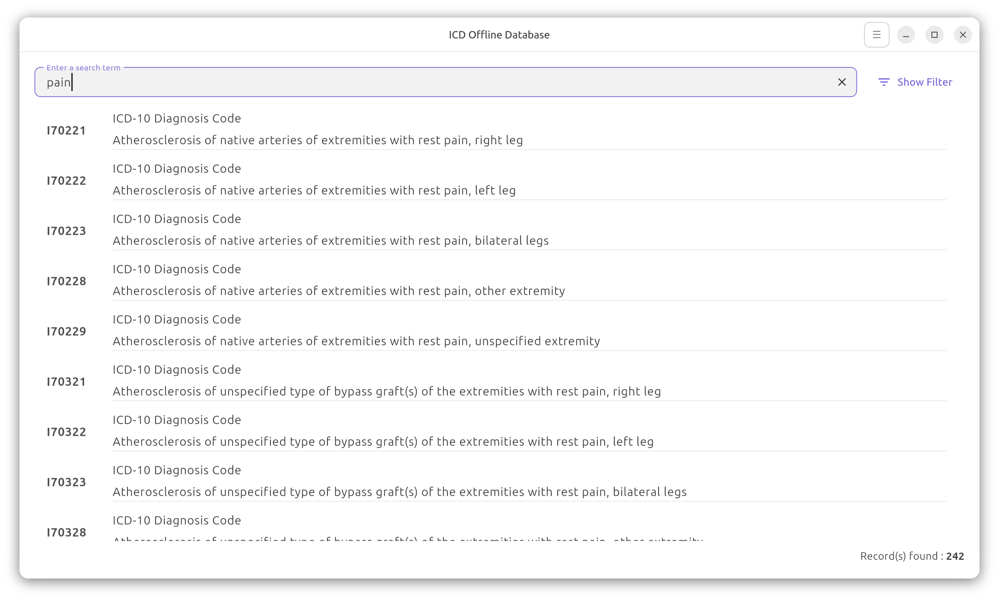

# ICD Offline Database

ICD Offline Database is a free and open-source application that allows users to search through the entire ICD-10 and ICD-9 databases of codes.

## Features:

*   Search through the whole ICD-10 and ICD-9 databases.
*   Convert codes from ICD-9 to ICD-10 and vice-versa.
*   Filter searches to specific code types:
    *   ICD-9 Diagnosis
    *   ICD-9 Procedures
    *   ICD-10 Diagnosis
    *   ICD-10 Procedures
*   Filter searches to a selected ICD section.

## Screenshots

<a href="screenshots/screenshot01.png"></a>
<a href="screenshots/screenshot02.png"></a>
<a href="screenshots/screenshot03.png"></a>
<a href="screenshots/screenshot04.png"></a>


## Dependencies

This application requires the SQLite 3 library to be installed on your system.

### Installation of sqlite libraries

**Ubuntu/Debian:**

```bash
sudo apt-get -y install libsqlite3-0 libsqlite3-dev
```

**Fedora/CentOS/RHEL:**

```bash
sudo dnf install sqlite-devel
```

## Installation sources
### From Snap Store

[](https://snapcraft.io/icdofflinedb)

### As .dep package

1. Download the latest `.deb` package from the project's GitHub releases page.
2. Open a terminal and navigate to the directory where you downloaded the file.
3. Install the package using the following command:

   ```bash
   sudo dpkg -i [name-of-the-package].deb
   ```

### As .rpm package

1. Download the latest `.rpm` package from the project's GitHub releases page.
2. Open a terminal and navigate to the directory where you downloaded the file.
3. Install the package using the following command:

   ```bash
   sudo rpm -i [name-of-the-package].rpm
   ```
